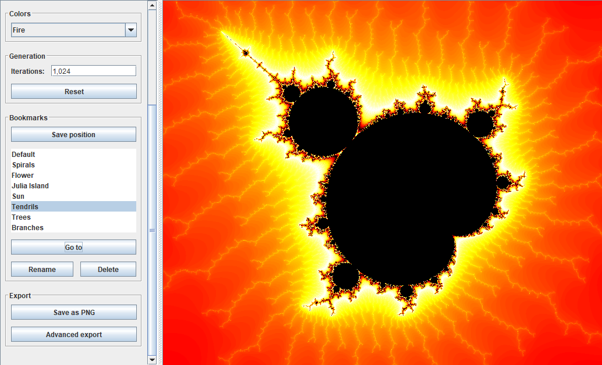

<!-- 

    <a href='https://github.com/braydenoneal/mandelbrot-navigator'>Mandelbrot Navigator</a>
    Java application for displaying and navigating the Mandelbrot set 
    

 -->

<!-- # Projects

## Artificial Intelligence

* [Neural Audio Classification](https://github.com/braydenoneal/neural-audio-classification)

## Graphics

* [Learning Computer Graphics](https://github.com/braydenoneal/learning-computer-graphics)

## Applications

* [Mandelbrot Navigator](https://github.com/braydenoneal/mandelbrot-navigator)

## Courses

* [CSCI 362: Introduction to Machine Learning](https://github.com/braydenoneal/csci-362)
* [CSCI 461: Artificial Intelligence](https://github.com/braydenoneal/csci-461)
-->
